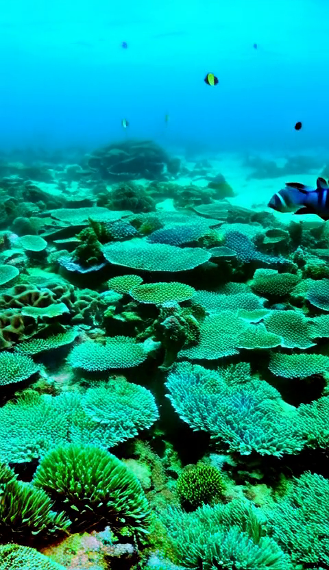
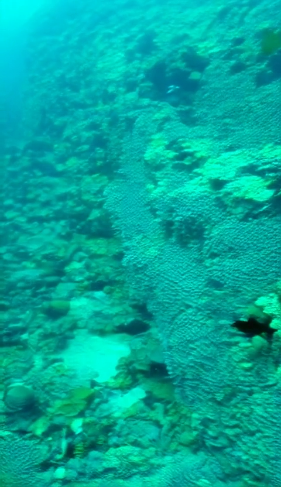
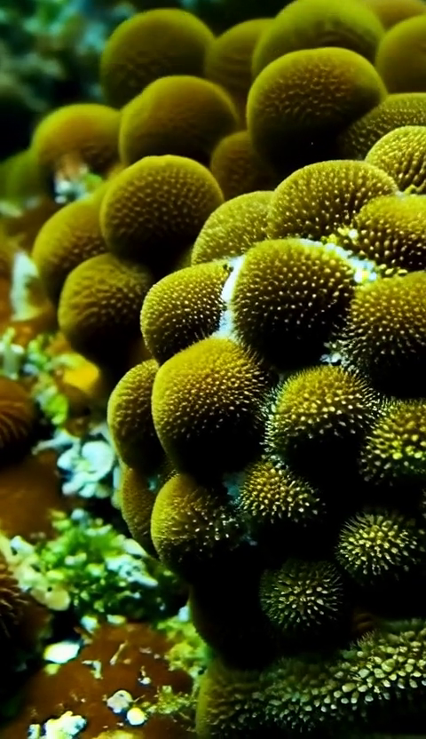
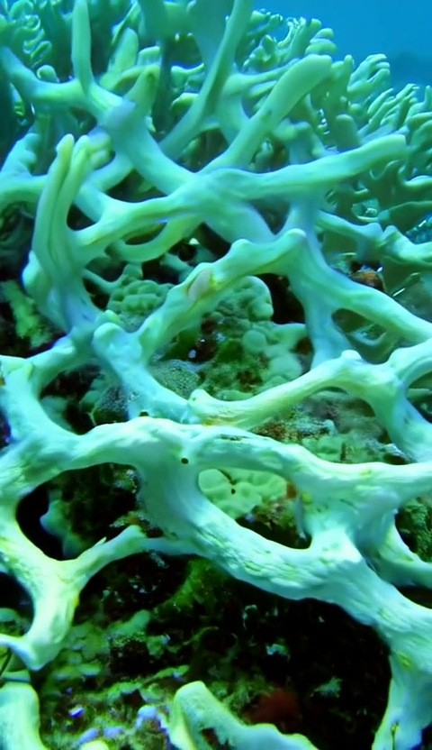
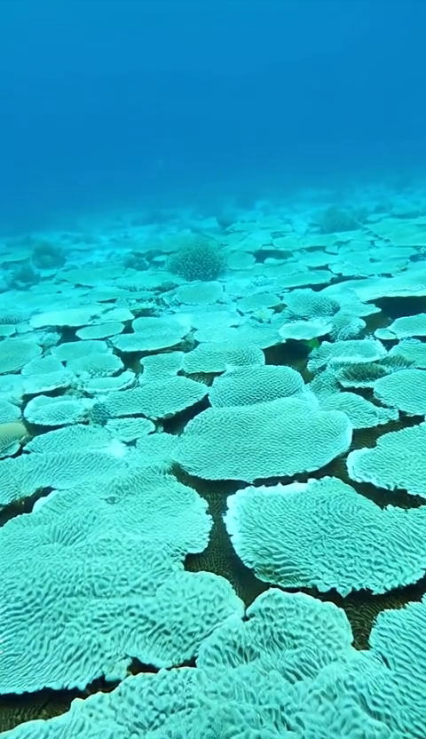
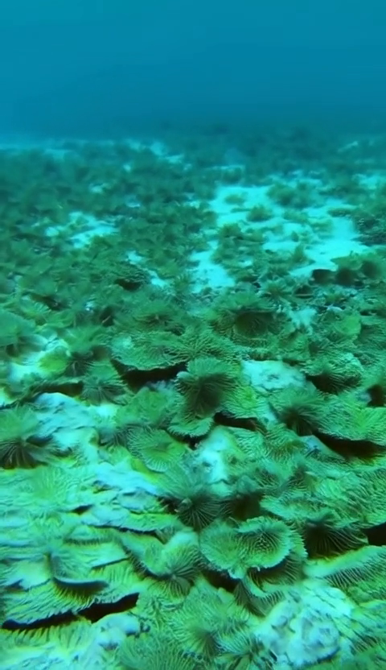
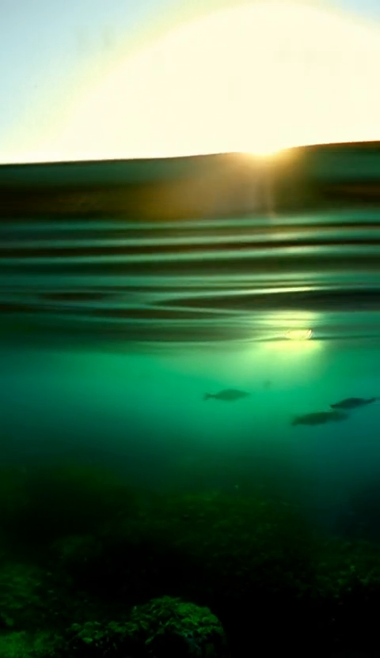

# Silent Tides
### A 35-second climate short film, generated in ComfyUI
**AI for Good: Hackathon 4 "Picture the Planet" · SDG 13: Climate Action**

- **Watch on YouTube (unlisted):** https://youtu.be/nW8UBwSIesA
- **Film file:** [`film/silent_tides.mp4`](film/silent_tides.mp4) (720p copy; the 1080p original is on YouTube)
- **ComfyUI workflow:** [`workflow/silent_tides_workflow.json`](workflow/silent_tides_workflow.json)

> **Every frame in this film is AI-generated.** It does not show any real reef, place or event. The statistics are real and the sources are listed below.

---

## Repository contents

```
film/silent_tides.mp4               final cut, 35 s (28 s of shots + AI-disclosure end card), 720p
workflow/silent_tides_workflow.json ComfyUI workflow (Wan 2.2 TI2V 5B)
clips/shot_01.mp4 … shot_07.mp4     raw ComfyUI output per shot
frames/shot_01.png … shot_07.png    one still per shot (for the shot list)
README.md                           this file
```

## Team & contributions

| Name | Contribution |
|---|---|
| **Lan Dinh** | Storyboard and shot list, refining the ComfyUI workflow (prompts, seeds, frame lengths), rendering all 7 shots, README and ethical reflection |
| **Evaldas** | Base ComfyUI workflow (Wan 2.2 TI2V setup), voiceover (Kokoro TTS in ComfyUI), editing the final cut in CapCut |

---

## 1. The issue & source

**Problem:** The ocean absorbs heat from climate change, and that heat is killing coral reefs faster than they can recover.

- **What:** In a marine heatwave the water gets warmer than corals can tolerate. They expel the algae that live inside them and give them their colour and food, turn white ("bleaching"), and die if the heat lasts too long.
- **How big:** From **1 January 2023 to 30 March 2025**, bleaching-level heat stress hit **84% of the world's reefs**. This is the fourth global bleaching event and the most intense on record. Earlier events reached 21% (1998), 37% (2010) and 68% (2014-2017).
- **Where / who:** **82 countries, territories and economies** have been damaged, across the Pacific, Atlantic and Indian Oceans. Reefs support about **a quarter of all marine species** (NOAA; ICRI even puts it at a third of all known marine life), and **one billion people** benefit from them directly or indirectly through food, jobs and coastal protection.
- **When:** It is still going on. It is not a forecast for 2100.

**Main source:** International Coral Reef Initiative (ICRI), *"84% of the world's coral reefs impacted in the most intense global coral bleaching event ever"*, 23 April 2025: https://icriforum.org/4gbe-2025/. Every figure above comes from this page.
**Background:** NOAA Coral Reef Watch, *Current Global Bleaching: Status Update*: https://coralreefwatch.noaa.gov/satellite/research/coral_bleaching_report.php

## 2. Which SDG, and why

**SDG 13: Climate Action.** The cause in this film is **atmospheric warming that the ocean absorbs**. It is a climate problem, and the fix is cutting emissions. The dying reef is just where the damage becomes visible. We deliberately left plastic and overfishing out of the story. Those belong to SDG 14 (Life Below Water), and mixing them in would blur the cause we are pointing at.

**Who benefits if the film works:** first, the viewers. They get an accurate, dated picture of climate damage that has already happened, instead of a vague future threat. Through them, it also helps the one billion people who depend on reefs, most of them in coastal communities in the tropics. Their reefs only survive if emissions come down, and young EU voters and consumers are part of the pressure that makes that happen.

## 3. Audience

**Who it's for:** Dutch/EU **18-30 year-olds** who already accept that climate change is real but see it as slow, distant and "something for 2100". They scroll Instagram Reels, TikTok and YouTube Shorts.

**What they already believe:** "Climate change is real. It's about CO₂, melting ice and the future." What they haven't taken in is that a record-breaking, planet-wide ecosystem collapse **already happened, between 2023 and 2025**.

**Who it's NOT for:**
- **Marine biologists and climate-policy experts.** 35 seconds is far too simple for them.
- **Climate deniers.** The film takes climate change as given and doesn't try to argue them round.
- **Young children.** The bleached-reef shot is deliberately bleak.

**Their situation and needs:** they watch on a phone, often with the sound off, and decide within about 3 seconds whether to keep watching. They don't need more general warnings. They need something concrete, dated and visual that makes climate change feel present instead of abstract.

**Placement:** a short-form feed (Reels / Shorts / TikTok) on a phone, with captions so the film works with the sound off.

## 4. Concept & message

**Structure:** Beauty → Cause → Consequence → Agency. First the viewer sees something worth caring about, then the heat that kills it, then the result, then what can still be done.

**Message in one line:** *The ocean absorbed our heat, and 84% of the world's reefs paid for it. What happens next is still up to us.*

**Voiceover / caption script:**

| Time | Line |
|---|---|
| 0:00-0:04 (shot 1) | "A quarter of all sea life depends on coral reefs." |
| 0:04-0:08 (shot 2) | "But the ocean has been absorbing our heat." |
| 0:08-0:16 (shots 3-4) | "When water gets too hot, corals begin to bleach. They push out their algae and turn white." |
| 0:16-0:20 (shot 5) | "Heat stress hit eighty-four percent of the world's reef area." |
| 0:20-0:28 (shots 6-7) | "Some reefs can recover, if the heat stops. Cut emissions. Act on SDG 13." |
| 0:28-0:35 (end card) | "The video and voice is AI generated. The statistics are real and sourced." |

Every line is also burned in as captions, so the film works with the sound off.

---

## 5. Shot list / storyboard

**7 shots × 4 s = 28 s, plus a ~7 s black AI-disclosure end card = 35 s.** Every shot was generated with the same workflow (§6) and the **same fixed seed, `112233`**. Between shots only the positive prompt and the clip length changed. The prompts, seed and lengths below were read from the metadata that ComfyUI saves inside each output clip.

**Shared negative prompt:** the Wan 2.2 default negative prompt (in Chinese, it blocks oversaturation, static frames, blur, subtitles, deformed bodies and similar) **plus** `text, watermark, logo, human faces, cartoon, 3d render, plastic look, flicker, morphing geometry`

| # | Time | What the viewer sees | Positive prompt | Seed | Frames | Source clip | Frame |
|---|---|---|---|---|---|---|---|
| 01 | 0:00-0:04 | A healthy, colourful reef full of fish. This is the baseline we're about to lose. | `hyper-realistic underwater wide shot, thriving coral reef, iridescent anthias and clownfish, sea anemones, sunlight caustics through clear water, shallow depth of field, slow forward dolly, coral swaying, photoreal underwater cinematography, natural colour grade, cinematic` | 112233 | 97 | `ComfyUI_00004_` |  |
| 02 | 0:04-0:08 | The camera drifts along a reef wall as fish part around it. | `medium underwater tracking shot along vibrant coral wall, schooling fish parting, volumetric god rays, turquoise clarity, lateral track left to right, photoreal underwater cinematography, natural colour grade, cinematic` | 112233 | 97 | `ComfyUI_00005_` |  |
| 03 | 0:08-0:12 | The turn: the water shimmers with heat and the colour starts to drain. | `close-up coral colony, thermal shimmer distortion in water, colour desaturating, warm sickly cast, first signs of stress, macro, slow push-in, photoreal underwater cinematography, natural colour grade, cinematic` | 112233 | 97 | `ComfyUI_00006_` |  |
| 04 | 0:12-0:16 | Close-up of the coral turning bone-white as it dies. The bleaching shown up close instead of explained. | `extreme macro of coral bleached white coral reef, skeletal structures tissue turning white like rock then bone-white calcium carbonate skeleton because they are dying, micro push-in, drifting particles, photoreal underwater cinematography, natural colour grade, cinematic` | 112233 | 113 | `ComfyUI_00014_` |  |
| 05 | 0:16-0:20 | The result: a wide, silent field of dead white reef with almost no fish. | `wide underwater shot, vast bleached white coral reef, skeletal structures, grey-blue water, near-total absence of fish, desaturated, bleak, slow lateral crawl, photoreal underwater cinematography, natural colour grade, cinematic` | 112233 | 97 | `ComfyUI_00009_` |  |
| 06 | 0:20-0:24 | Cooler water, and faint colour starts returning to the bleached coral. Recovery is possible but fragile. | `medium shot, bleached coral with faint returning pigment, thin new tissue growth, clearer cooler water, hopeful but fragile, gentle rise, light returning, photoreal underwater cinematography, natural colour grade, cinematic` | 112233 | 97 | `ComfyUI_00010_` |  |
| 07 | 0:24-0:28 | The camera rises to the sunlit surface over a reef that has partly recovered. | `wide underwater shot rising toward the sunlit surface, partially recovered reef, returning fish life, golden surface light, crane lift to the surface, photoreal underwater cinematography, natural colour grade, cinematic` | 112233 | 113 | `ComfyUI_00015_` |  |

The clips rendered at 113 frames (≈4.7 s) are cut to 4 s in the edit.

**Shot 04 took 6 attempts.** The first version described the biology directly ("coral polyp, zooxanthellae expelled as fine particles, tissue turning translucent"). Over 5 renders (`00007`, `00008`, `00011`-`00013`), Wan didn't produce a readable image from that wording, even at longer lengths. What worked was describing what bleaching *looks like* instead ("coral turning white like rock… bone-white skeleton").

Shots 06-07 show only *partial* recovery on purpose. Reefs that bleach badly take a decade or more to come back, and only if the heat doesn't return. A fully restored reef would overstate what the science says.

---

## 6. The ComfyUI workflow

### From input to output

| Step | Input | What happens | Output | Tool |
|---|---|---|---|---|
| 1 | Shot list (§5) | We write one text prompt per shot. | 7 prompts | - |
| 2 | One prompt + seed 112233 + frame length | **Wan 2.2 generates the video from the text alone.** No image, photo or footage goes in. | One vertical 480×832 clip per shot, 24 fps | **ComfyUI** |
| 3 | Voiceover script (§4) | Kokoro TTS reads the script aloud. | Voiceover audio (.wav) | **ComfyUI** |
| 4 | 7 clips + voiceover | The clips are put in order, trimmed to 4 s each, and captions and the black AI-disclosure end card are added. | `film/silent_tides.mp4`, 35 s | CapCut |

**Why the film can't exist without ComfyUI:** every image and every second of motion in the film comes out of step 2. Without it there's no footage at all, because we didn't use any camera, stock video or photos. The only alternatives would be filming a real bleached reef, which we have no access to, or using stock footage, which the brief doesn't allow. CapCut only cuts and labels clips that ComfyUI made. It doesn't generate anything.

### The graph

The workflow is the standard **Wan 2.2 TI2V 5B text-to-video** graph, set up for our shots. Every frame in the film came out of this graph. There is no stock footage, no photos and no other image generator.

```
UNETLoader (wan2.2_ti2v_5B_fp16) ─► ModelSamplingSD3 (shift 8) ─┐
CLIPLoader (umt5_xxl_fp8, type wan) ─► CLIPTextEncode (+ / −) ──┼─► KSampler ─► VAEDecode ─► CreateVideo (24 fps) ─► SaveVideo (.mp4)
VAELoader (wan2.2_vae) ─► Wan22ImageToVideoLatent (480×832, 97 frames; 113 for shots 04 & 07) ─┘
                          (LoadImage start frame: bypassed → pure text-to-video)
```

| Setting | Value |
|---|---|
| Model | `wan2.2_ti2v_5B_fp16.safetensors` |
| Text encoder | `umt5_xxl_fp8_e4m3fn_scaled.safetensors` |
| VAE | `wan2.2_vae.safetensors` |
| Resolution | 480 × 832 (vertical) generated, upscaled to 1080p on export from CapCut |
| Length | **97 frames** at 24 fps ≈ 4.0 s for shots 01-03, 05 and 06 · **113 frames** (≈4.7 s) for shots 04 and 07, cut to 4 s in the edit |
| Sampler | `uni_pc`, scheduler `simple` |
| Steps / CFG / denoise | 13 / 5.0 / 1.0 |
| Model sampling shift | 8 |
| Seed | `112233` for every shot, control set to **fixed** |
| Output | `SaveVideo` default prefix → `ComfyUI/output/video/ComfyUI_000xx_.mp4` |

## 7. How to run / regenerate a shot

**1. Install ComfyUI** (desktop app or portable): https://comfy.org/. The video workflow uses only core nodes, so you don't need any custom nodes for it. The voiceover additionally needs the ComfyUI-KokoroTTS custom node (see §8).

**2. Download the models** (Comfy-Org repackaged, Hugging Face: `Comfy-Org/Wan_2.2_ComfyUI_Repackaged`) and place them like this:

```
ComfyUI/models/
├── diffusion_models/  wan2.2_ti2v_5B_fp16.safetensors     (9.3 GB)
├── text_encoders/     umt5_xxl_fp8_e4m3fn_scaled.safetensors (6.3 GB)
└── vae/               wan2.2_vae.safetensors               (1.3 GB)
```

**3. Regenerate a shot**
1. Drag `workflow/silent_tides_workflow.json` into ComfyUI.
2. Paste that shot's positive prompt from §5 into **CLIP Text Encode (Positive Prompt)**. Leave the negative prompt as it is.
3. In the **KSampler**, check that the seed is `112233` and control is set to **fixed**.
4. In **Wan22ImageToVideoLatent**, set `length` to that shot's frame count from §5: **97**, or **113** for shots 04 and 07.
5. Click **Run**. The clip is saved to `ComfyUI/output/video/`.

**4. Rebuild the film:** put clips 01-07 in order in **CapCut**, add the Kokoro voiceover, captions and the black end card, and export as MP4 at 720p or 1080p.

**Reproducibility note:** the same seed, prompt, settings and model files produce the same clip. A different GPU or PyTorch version can cause small pixel differences.

**Hardware:** rendered on an AMD Radeon RX 6950 XT (16 GB VRAM), i5-12600K, 32 GB RAM, using the ComfyUI Desktop app. About 4 minutes per 97-frame clip.

---

## 8. Sound

- **Voiceover:** generated **inside ComfyUI** with the Kokoro TTS custom node (ComfyUI-KokoroTTS, installed via ComfyUI-Manager) from the script in §4, using one of Kokoro's stock voices. The brief allows sound generated in ComfyUI. No third-party AI voice tools (ElevenLabs etc.) were used.
- **Captions:** generated from the voiceover and burned in during the CapCut edit.

---

## 9. Ethical reflection

| Risk | What it would mean for our viewers | What we did about it |
|---|---|---|
| **The footage gets taken for real documentary footage.** It looks photoreal, but it isn't any real reef. | A viewer screenshots shot 05, shares it as "the Great Barrier Reef right now", and someone debunks it. Fake images in climate communication give deniers an easy argument, and they can make viewers distrust *real* reef footage too. | We never name or suggest a real location. The film ends on a black end card (0:28-0:35) with the on-screen text **"The video and voice is AI generated. The statistics are real and sourced."**, and the same note is at the top of this README. The images show *how* bleaching works, while the one hard number (84%) comes from a cited source, so viewers can check the claim without trusting the pictures. |
| **The voice sounds like a real narrator.** | Viewers might assume a real expert or organisation is speaking. | The voice is a stock Kokoro TTS voice generated in ComfyUI, not a clone of a real person. It's disclosed on the same end card. |
| **Emotional manipulation.** Shot 05 is designed to feel bleak. | Climate despair makes young people tune out. That's the opposite of what we want from this audience. | Shots 06-07 end on *partial, conditional* recovery: realistic hope without a fake happy ending. The bleakness is backed by a real, sourced number, so it's persuasion based on facts, not exaggeration. |
| **The training data was used without consent.** | Wan 2.2 learned from imagery scraped from the web, likely including underwater photographers' work, without paying or asking them. | We can't fix this ourselves. We kept the project non-commercial and state it openly here. |

No people appear in the film, so there are no issues with anyone's face or likeness.

**Energy cost:** To get 7 usable shots we generated **15 clips**, and **8 of them were thrown away**. Before that we also ran a few tests with a different video model (LTX) and abandoned it. Everything ran locally on one PC with an **AMD Radeon RX 6950 XT** (16 GB, up to 335 W) and an i5-12600K. The ComfyUI log shows how long each render took:

| | Clips | Kept | GPU time |
|---|---|---|---|
| LTX tests (different model, abandoned) | - | 0 | ≈ 35 min |
| Wan 2.2 setup runs that never produced a clip | - | 0 | ≈ 75 min |
| Wan 2.2 short test clips (49 frames, `00001`-`00003`) | 3 | 0 | not logged (earlier session) |
| Wan 2.2 shot renders (`00004`-`00015`) | 12 | 7 | ≈ 64 min (≈ 4 min per clip once set up) |
| **Total** | **15** | **7** | **≈ 2.9 hours** |

Of the 12 shot renders, the 5 we threw away were all failed attempts at shot 04 (see §5).

At roughly 400 W for the whole PC, that comes to about **1.2 kWh**, or about **0.3 kg CO₂** on the Dutch grid (0.27 kg/kWh). That's about the same as one washing-machine cycle, or driving 2 km in a petrol car.

We think that's a small, defensible cost for a film meant to reach thousands of people. But it's still extra energy spent making a film about climate, and most of it was wasted. **Only about a quarter of the GPU time (≈ 44 of 174 min) went into the 7 clips that are in the film.** The rest went into an abandoned model, setup runs, and five tries at shot 04. Next time we would settle on one model first and test prompts as short, low-resolution clips before rendering at full length. That would have caught the shot 04 prompt problem after one cheap test instead of five full renders.

---

## 10. Problem-solution fit

The audience believes in climate change but thinks of it as something far away and in the future. The film is built around that:

- **The damage is hidden underwater.** So the whole film is shot underwater, and the viewer watches the reef die from inside it.
- **It feels slow and far away.** So a three-year event is squeezed into seconds, and the 84% is told in the past tense ("heat stress *hit*"). It already happened, not a forecast for 2100.
- **People can't picture bleaching.** So shot 04 shows the coral itself turning white.
- **The audience scrolls with about 3 seconds of patience.** So the film opens on a beautiful reef, is short and vertical, and works with the sound off.
- **Doom with nothing to do makes people tune out.** So shots 06-07 end on recovery that is still possible and depends on cutting emissions.

**Why a film, and not something simpler like an article, an infographic or a single image?** This audience doesn't read climate articles in their feed, but they do watch 30-second videos. A number like "84%" on an infographic means little on its own. Watching a colourful reef go white in a few seconds makes it felt. A single still image can show a dead reef, but it can't show the change from alive to dead, and that change is the whole story.

**Why this audience?** They have the most years of climate impact ahead of them and the most voting and spending decisions still to make, and short-form platforms reach them for almost nothing.

**What we realistically expect:** not that one 35-second video changes anyone's behaviour. A realistic success is that viewers remember "84%, already happened" and share the video. Those are small steps, but they are what moves climate change from "later" to "now" for this group.

---

## AI use

Every frame was generated in ComfyUI (Wan 2.2) and the voiceover with Kokoro TTS in ComfyUI. Both are part of the assignment. We also used Claude (Anthropic) to help plan the shot list, check our sources and settings against the brief and rubric, and write this README. All numbers (seeds, frame counts, render times) were read from our own ComfyUI output files and logs.

---

*Silent Tides is an AI-generated student prototype for SDG 13: Climate Action. All imagery is synthetic and all figures are sourced.*
